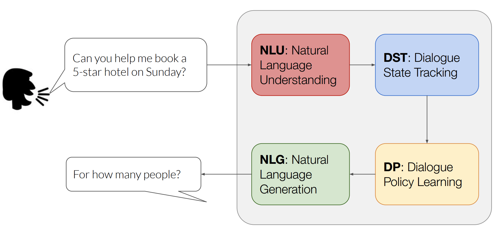
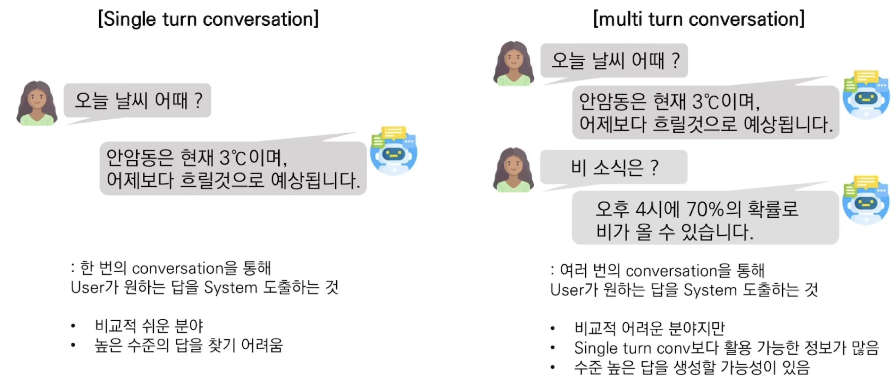
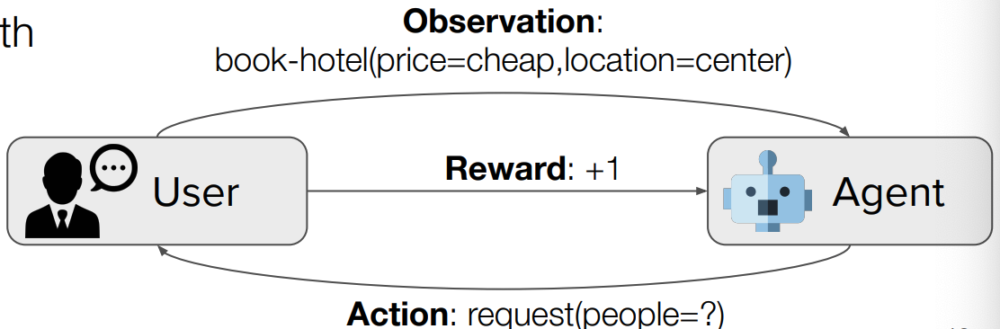
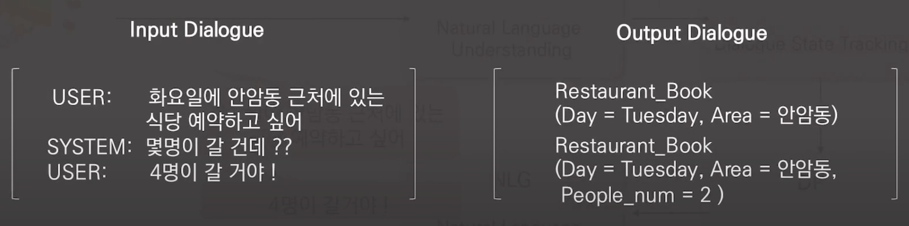
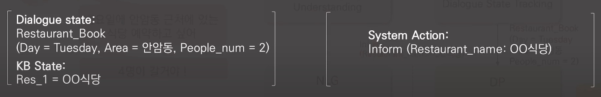
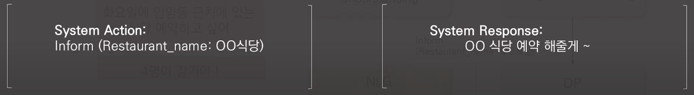

## 개요

Dialogue System, Conversational System

대화 시스템(Dialogue System)은 도메인에 따라 크게 2가지로 나누어집니다.

* Task-Oriented
    - 미리 정의된 goal과 task하에서 이루어지는 모델
    - 특정 영역에서만 활동하는 시리 같은 기능형 챗봇
    
* Open-domain
    - 자유로운 영역에서 활동하는 챗봇

## Task-Oriented(목적 지향)

특정 Task에서 사용자의 요구사항을 파악하고 이를 해결하기 위한 적절한 대화 시스템.

- User: 시스템 사용자
- System: Siri, Clova AI 등
- Data: Specific scenarios, 호텔 예약, 관심 검색 등

## Sigle turn and Multi turn

## QA와 비교

||Dialogue System| Question Answering|
|---|---|---|
|소개|사람-사람, 사람-시스템 간의 대화를 가정|특정 상황을 가정하지 않고 질문에 대한 답을 제공|
|데이터셋|특정 시나리오를 가정한 대화 데이터|길이가 긴 텍스트로부터 정답의 위치를 알려줌|
|출력|화자의 질문으로부터 알맞는 정답, 정답을 포함한 문장을 생성하는 것이 최종 목적|질문에 맞는 단어 혹은 구절|
|Task|질문을 이해하고 정답을 생성하기 위해 여러개의 sub-task로 나누어져 있음|Single task로 수행 가능|

## TOD 구조

Task-Oriented 시스템은 보통 크게 NLU, DST, DP, NLG 4개의 task로 구분됩니다.

* NLU
    - 사용자의 발화를 이해하고 분석되어 정형화된 데이터로 변환합니다.
    - Domain identification, intent classification, slot filling
    - ex) domain(Weather), intent(Search-Weather), location slot value(Seoul), date slot value(2020-05-17)
* DST
    - Dialogue가 주어졌을 때 상황(dialogue state)을 파악하는 역할
    - 주로 BERT기반 모델이 제안되고 있습니다.
    - 
* DP
    - dialogue state와 KB를 결합하여 정보(system action)를 제공하는 역할
    - 정책을 사용하는 강화학습이 주로 제안됨
    - 
* NLG
    - DP를 통해 system action이 정해졌다면 이를 자연어로 생성해내는 역할
    - Transformer 계열의 모델을 주로 사용
    - ex) "내일 서울에는 비가 올 예정입니다. 우비와 장화를 꼭 챙기세요!"

## Open-domain

모델의 주 목적은 사용자에게 특정 persona를 갖는 적절한 대답(reply)을 생성하는 것 입니다.

또한 한창 연구 중인 영역이기 때문에 딱히 정해진 아키텍처는 없는 듯 합니다만

검색 모델(Retrieval-based model)과 반대되는 생성 모델(Generative model)을 주로 씁니다.

그 이유는 검색 모델은 정해진 답변에서 적절한 답변을 고르는 모델이기에 Task-Oriented에 주로 사용되는 방식이고

생성 모델은 적절한 답변을 생성하기 때문입니다.

## Retrieval-based model 특징
- 장점
    - 답변의 내용이 정확합니다.
    - 문법에 안맞는 답변을 하지 않습니다.
- 단점
    - 미리 준비된 답변만 가능합니다.
    - 기계 같다?

## Generative model 특징
- 장점
    - 답변을 정해주지 않아도 됩니다.
- 단점
    - 훈련 시키기 위해서는 엄청난 양의 데이터가 필요합니다.
    - 잘못된 답변을 할 확률이 높습니다.
    - 질문이 같아도 일치하지 않는 답변을 할 수 있습니다.
    - 문법에 안맞는 답변을 하기도 합니다.

[참고](https://d2.naver.com/helloworld/2110494)

## ParlAI가 지원하는 데이터셋 정리

- PersonaChat
- DailyDialog
- Wizard of Wikipedia
- SQuAD
- bAbl Dialogue tasks

## NLU

NLU에서 이루어지는 작업은 크게 다음으로 나누어집니다.

- Domain Identification
- Intent Classification
- Slot Filling

### Domain Identification

어떤 Domain(영역)의 발화인지 인지하는 과정입니다.

### Intent Classification

사용자의 현재 목표를 이해하기 위해 의도 검출기를 활용하여

사용자의 발언을 여러 사전 정의된 클래스 중 하나로 분류해야 합니다.

[참고](https://paperswithcode.com/task/intent-detection)

### Slot Filling

대화 중 사용자의 쿼리에서 서로 다른 슬롯을 식별하는 것입니다.

예를 들어 사용자가 인근 식당을 조회해달라고 한다면

주요 슬롯은 `위치`와 `선호 음식`입니다.

그리고 이 슬롯을 채우기 위해 시스템은 사용자에게 위치와 선호 음식을 묻게 됩니다.

[참고](https://paperswithcode.com/task/slot-filling)

## DST

Dialogue State Tracking(DST)이란 Question Answering, Text-to-SQL과 같은 Semantic Parsing의 일종입니다.

이는 사용자와 시스템의 대화 내에서 사용자의 목적을 State라고 정의한 뒤, 그 State들을 정립해 나가는 과정입니다. 

인공지능 스피커를 가지고 계신 분들이라면, 스피커와의 대화 속에서 인공지능이 정확하게 사용자의 요구를 파악한 뒤 그것을 행하는 전초 작업이라고 생각하시면 됩니다. 

DST의 성능 지표는 Joint Goal Accuracy를 사용합니다.

이는 각 턴의 정답 slot value와 생성해낸 value가 모두 일치할 때 +1을 하게 됩니다.

### 유형

DST의 유형은 크게 2가지로 나누어집니다.

- Predefined Ontology
    - 미리 Dialogue Ontology를 구축해두고 상황에 맞는 답을 찾아내는 방식
    - 모든 경우의 수를 고려할 수 없어 Unseen domain, slot, value는 처리 불가
- Open Vocabulary
    - Input에 따라 state를 즉각적으로 생성하는 방식
    - 비교적 유연하여 실제 대화에 더 적합하며 Unseen domain, slot, value도 처리 가능
    - 요즘 추세

### DST vs IE(Information Extraction)

||DST|IE|
|---|---|---|
|input|User: 화요일에 안암동 근처에 식당 예약하고 싶어, Sys: 몇명이 갈건데?, User: 4명이 갈거야!|화요일에 안암동 근처에 있는 식당 예약하고 싶어|
|Output|Restaurant_Book(Day = Tuesday, Area = 안암동, People_num = 2)|(나는)-예약 하고싶다-식당 : 트리플 형식|
|목적|유저의 의도, slot에 따른 value|Relation과 Argument|

### Challenge

1. Open vocabulary 상황에서 좋은 성능을 달성
2. 실제 대화에서는 여러 domain을 다루기 때문에 multi domain의 대화를 다루는 것

### 어려움

1. DST model은 한번의 Dialogue turn마다 (Domain, Slot, Value)를 결정하는데 가능한 조합의 수가 많음
2. Multi turn mapping을 수행해야 함
    - multi turn mapping : 여러 번 대화가 이루어지는 multi turn 대화 상황에서 매 turn 마다 (slot, value)를 추출하면서 multi domain 상황일 경우 domain별로 추가로 여러 번 추론을 진행해야함

### TRADE model

- Multi-domain dialogue state tracking을 진행
- Open vocabulary DST model

[참고](https://www.youtube.com/watch?v=nuclwoebdEM)

## DP

DP는 DST로 부터 추출된 Dialogue State를 기반으로 시스템의 행동을 결정합니다.

여기서 입력으로 Dialogue + KB results를 받습니다.

## NLG

DP의 출력을 받아서 적절한 대답을 생성하는 파트입니다.

[참고](https://www.topbots.com/conversational-ai-task-oriented-chatbots/)