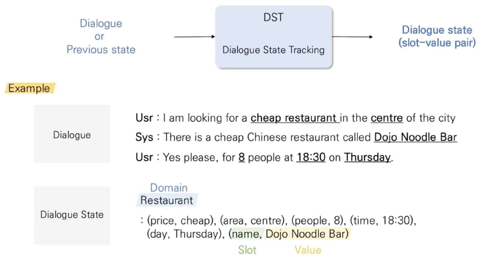

## 개요

Dialogue System, Conversation AI, ChatBot

대화 시스템(Dialogue System)은 도메인에 따라 크게 2가지로 나누어집니다.

* Task-Oriented
    - 미리 정의된 goal과 task하에서 이루어지는 모델
    - 특정 영역에서만 활동하는 시리 같은 기능형 챗봇
    
* Open-domain
    - 자유로운 영역에서 활동하는 챗봇

## Task-Oriented(목적 지향)

Task-Oriented 시스템은 보통 크게 NLU, DST, DP, NLG로 구분됩니다.

* NLU
    - 사용자의 발화를 이해하기 위한 모듈
    - Slot, Domain, Intent를 정확하게 인식하는 것이 목표
    - ex) intent(Search-Weather), location(Seoul), date(2020-05-17)
* DST
    - Dialogue가 주어졌을 때 상황(dialogue state)을 파악하는 역할
    - BERT기반 모델이 제안되고 있습니다.
    - 
* DP
    - dialogue state와 KB를 결합하여 정보(system action)를 제공하는 역할
    - 정책을 사용하는 강화학습이 주로 제안됨
    - 
* NLG
    - DP를 통해 system action이 정해졌다면 이를 자연어로 생성해내는 역할
    - Transformer 계열의 모델을 주로 사용
    - ex) "내일 서울에는 비가 올 예정입니다. 우비와 장화를 꼭 챙기세요!"

## Open-domain

모델의 주 목적은 사용자에게 특정 persona를 갖는 적절한 대답(reply)을 생성하는 것 입니다.

또한 한창 연구 중인 영역이기 때문에 딱히 정해진 아키텍처는 없는 듯 합니다만

검색 모델(Retrieval-based model)과 반대되는 생성 모델(Generative model)을 주로 씁니다.

그 이유는 검색 모델은 정해진 답변에서 적절한 답변을 고르는 모델이기에 Task-Oriented에 주로 사용되는 방식이고

생성 모델은 적절한 답변을 생성하기 때문입니다.

## Retrieval-based model 특징
- 장점
    - 답변의 내용이 정확합니다.
    - 문법에 안맞는 답변을 하지 않습니다.
- 단점
    - 미리 준비된 답변만 가능합니다.
    - 기계 같다?

## Generative model 특징
- 장점
    - 답변을 정해주지 않아도 됩니다.
- 단점
    - 훈련 시키기 위해서는 엄청난 양의 데이터가 필요합니다.
    - 잘못된 답변을 할 확률이 높습니다.
    - 질문이 같아도 일치하지 않는 답변을 할 수 있습니다.
    - 문법에 안맞는 답변을 하기도 합니다.

[참고](https://d2.naver.com/helloworld/2110494)