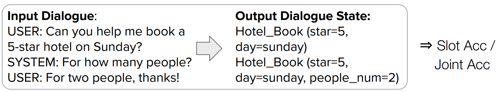

[참고](https://www.notion.so/TRADE-47f74ea2ed134116bc9a089591a8ee60)

## 개요

- [개요](#개요)

## DST

DST는 타입이 2가지로 나누어집니다.

- Predefined Ontology: 미리 dialogue ontology를 구축하고 상황에 맞는 답을 찾아내는 방식 (모든 경우의 수를 고려하지 못하지만 정확도가 높음)
- Open Vocabulary: Input에 따라 state를 즉각적으로 생성하는 방식 (실제 대화에 더 적합하지만 정확도가 떨어짐)

## 목적

1. Dialogue에서 User의 `goal` 혹은 `intention`을 파악 하는 것
2. User의 goal 혹은 intention을 compact 한 dialogue set(set of slots, their corresponding values)으로 encoding 하는 것

## 도전과제
1. 실제 시스템에서 ontology가 사전에 정의되기 어렵기 때문에 Open vocabulary 상황에서 좋은 성능 달성하는 것

2. 실제 시스템에서 이루어지는 대화는 하나의 domain에서 이루어지지 않기 때문에 multi domain의 대화를 다루는 것

## 어려움
1. DST model은 한번의 Dialogue turn마다 (Domain, Slot, Value)를 결정해야하는데 가능한 조합의 수가 많음

2. Multi turn mapping을 수행해야 함

## GloVe

글로브(Global Vectors for Word Representation, GloVe)는 카운트 기반과 예측 기반을 모두 사용하는 방법론입니다.

2014년 미국 스탠포드 대학에서 개발한 단어 임베딩 방법론으로 기존의 카운트 기반의 LSA와 예측 기반의 Word2Vec의 단점을 지적하며 보완한다는 목적으로 나왔습니다.

연구에 따르면 Word2Vec와 GloVe 둘 전부 사용해보고 성능이 더 좋은 것을 사용하는 것이 바람직하다고 합니다.
